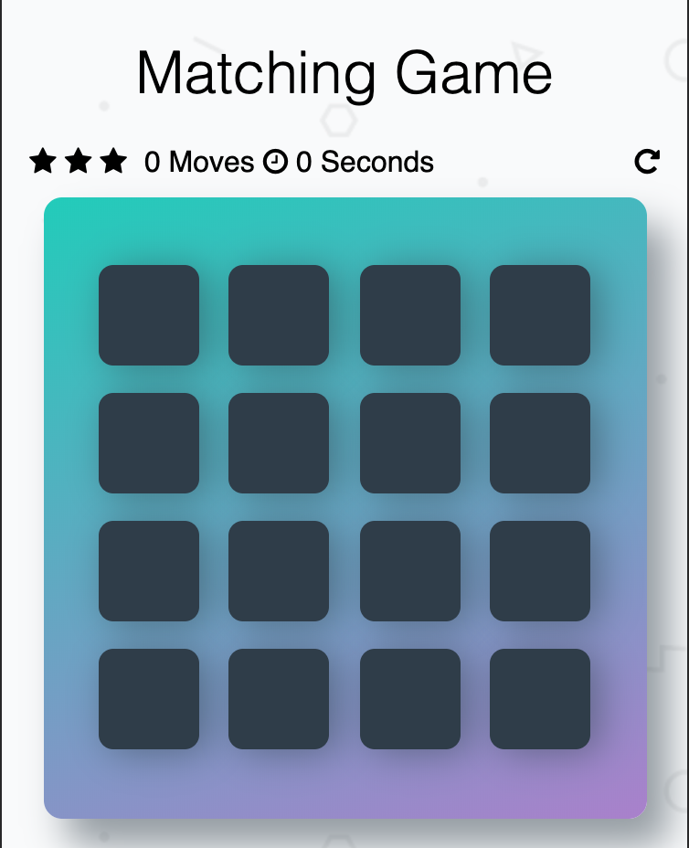
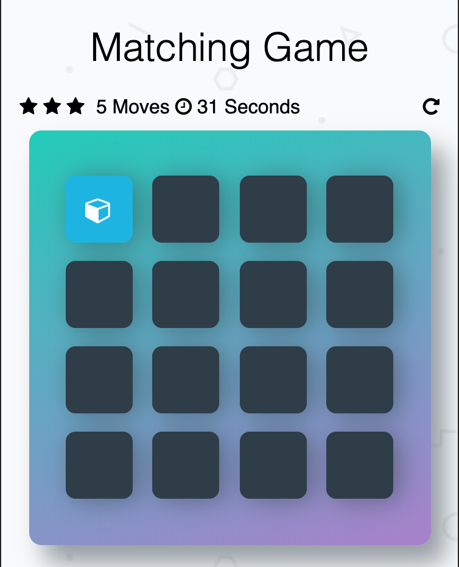
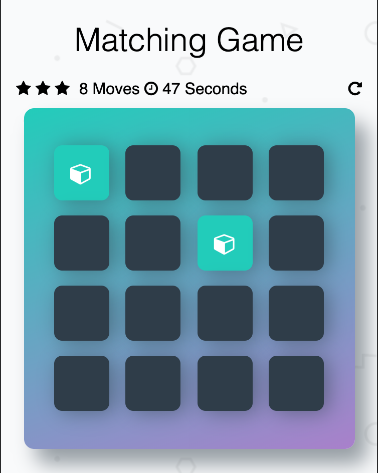

# Memory Game 

## Table of Contents

* [Instructions](#instructions)
* [How-to-play-the-game] (#How-to-play-the-game)
* [Screenshots](#Screenshots)
* [Dependencies](#Dependencies)
* [Contributing](#contributing)

## Instructions
This matching game is written as part of the Udacity Front-end Developer Course, where we have to finish different assignment. 
You can clone or download this repository, open the "index.html" and start playing around with the game. 

## How-to-play-the-game
On the deck there are 16 covered cards containing 8 pairs of similar cards. 
Your mission is to uncover all the cards within fewest number of moves and in fastest time. 

When you click on one card, it will turn the card and show the content of the card. 
Then you click on another card, the card is revealed, the game will check if two cards match (another word: have similar pattern on it). 
If they match,the colours of the card will turn green and be locked at the "showing" position. 
If they don't match, both of the cards will be turned back down again. 

When you have all the cards matched, you win the game. Congratulations. 
You will be informed in how many moves and how much time you need to finish the game. 

## Screenshots
- main screen

- open cards

- matched cards

## Dependencies
- Font Awesome 4.6.1

## Contributing

This repository is using the starter code for Udacity students. If you have any improvements for the code, I am happy to accept the great pull request and merge to the project.

